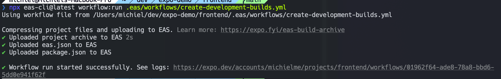

# Setting Up and Running the App

## Initial Setup

1. Create a new Expo app:

   ```bash
   npx create-expo-app@latest frontend
   ```

2. Navigate to the project directory:

   ```bash
   cd frontend
   ```

3. Reset the project to remove the Expo template:

   ```bash
   npm run reset-project
   ```

## Running the App

1. Start the development server:

   ```bash
   npx expo start
   ```

2. Install the Expo Go app from your device's app store (iOS App Store or Google Play Store)

3. Use your device's camera to scan the QR code displayed in the terminal to open the app in Expo Go

## EAS

1. Install EAS CLI

   ```bash
   npm install -g eas-cli
   ```

2. Login to EAS

   ```bash
   npx eas-cli@latest login
   ```

3. Create a new EAS project

   ```bash
   npx eas-cli@latest init
   ```

4. Configure the build

   ```bash
   eas build:configure
   ```

   
